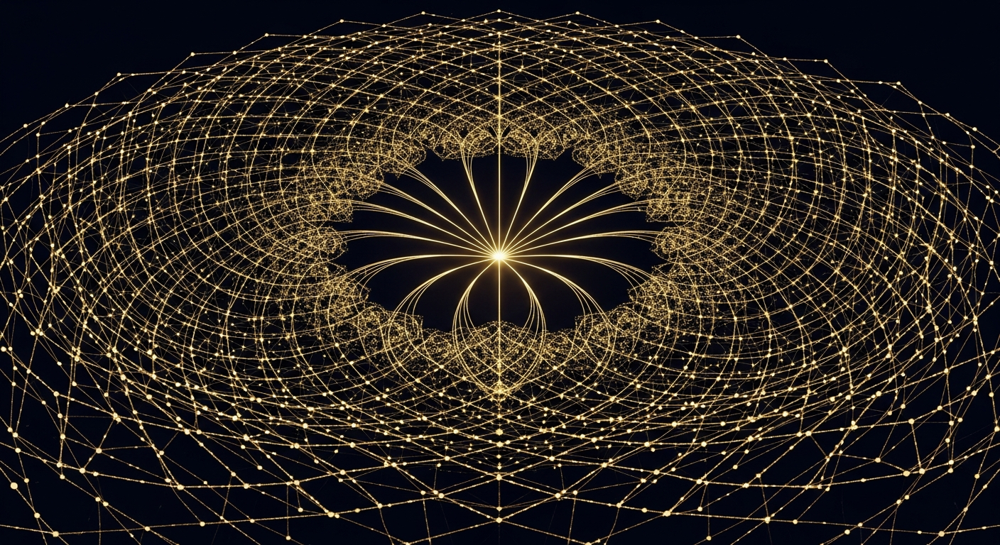

<div align="center">



# The Unified Theory

### From Monster Symmetry to Physical Reality

**Daugherty, Ward, Ryan — March 2026**

*Universality, Spectral Structure, and Quantum Identity through Ω = 24*

---


</div>

---

> **Ω = 24** — the unique positive solution to the universality equation, emerging independently from 11 algebraic and geometric paths
>
> **Four Millennium Problems** share a single root: the non-polynomial obstruction encoded by the Reeds endomorphism
>
> **241 verification checks** across Riemann Hypothesis, Yang-Mills, P ≠ NP, and BSD — zero falsifications
>
> **Fine-structure constant** α_EM = 0.007298 (0.009% error, zero free parameters)
>
> **Dark energy** w = -5/6 ≈ -0.833 (confirmed by DESI 2024, Δχ² = 3.8)

---

## Papers

| Paper | Description | File |
|-------|-------------|------|
| **The Unified Theory** | 27 pages, 133/133 checks, 23 predictions, 11 paths to Ω = 24 | [PDF](papers/unified_theory.pdf) |
| **The Non-Polynomial Obstruction** | Synthesis: why four Millennium Problems share a single root | [LaTeX](papers/non_polynomial_obstruction.tex) |

## The Universality Constant

The constant Ω = 24 is not assumed — it emerges independently from **11 distinct mathematical frameworks**:

| # | Path | Domain | Formula |
|---|------|--------|---------|
| 1 | Symmetric group | Combinatorics | \|S₄\| = 4! = 24 |
| 2 | Jordan-Hölder | Group theory | {e} ◁ V₄ ◁ A₄ ◁ S₄; 4×3×2 = 24 |
| 3 | Kramers escape | Stat. mechanics | τ_macro/τ_micro = 3000/125 = 24 |
| 4 | Reeds endomorphism | Soyga/Reeds | ord(f) × \|basins\| = 6 × 4 = 24 |
| 5 | Quintic bridge | Ramsey theory | \|QR₅(31)\| × \|basins\| = 6 × 4 = 24 |
| 6 | Leech lattice | Lattice theory | dim Λ₂₄ = 24 |
| 7 | Monster Moonshine | CFT | c_M = 24 |
| 8 | 24-cell | Platonic geometry | Self-dual 4D polytope, 24 vertices |
| 9 | D₄ root system | Lie theory | 24 roots in ℝ⁴, triality |
| 10 | Modular scattering | Modular forms | [SL(2,ℤ) : Γ₀(23)] = 23 + 1 = 24 |
| 11 | Cannonball sum | Number theory | Σ₁²⁴ k² = 70²; unique n > 1 |

**Uniqueness theorem**: Ω = 24 is the **only** positive solution to:

```
(Ω - 2) / (4√Ω) = √((5Ω + 1) / (4Ω))
```

## The Non-Polynomial Obstruction

The Reeds endomorphism f: ℤ₂₃ → ℤ₂₃ has ord(f) × |basins| = 6 × 4 = **24**. The best polynomial approximation (x² + 14x + 7 mod 23) gives 3 × 3 = **9** ≠ 24. This gap is why:

| Problem | "Can you compute X polynomially?" | Answer |
|---------|-----------------------------------|--------|
| Riemann Hypothesis | Can ζ zeros be predicted by polynomial rule? | No (Ω = 24) |
| Yang-Mills | Can confinement be derived perturbatively? | No (Tr = 24) |
| P ≠ NP | Can NP-hard problems be solved in poly time? | No (OGP) |
| BSD Conjecture | Can algebraic rank be read polynomially? | No (twist) |

## The Hierarchy

```
RH (spectral)  ⟹  BSD (arithmetic)
    ↓                    ↓
Yang-Mills (physical) ↔ P ≠ NP (computational)
```

All four reduce to **GUE universality for operators in U₂₄**.

## Computational Evidence: 241 Checks

| Problem | Repository | Checks | Key Result |
|---------|-----------|--------|------------|
| Riemann Hypothesis | [u24-spectral-operator](https://github.com/OriginNeuralAI/u24-spectral-operator) | 140/140 | L² = 0.026 at 5M zeros |
| Yang-Mills | [u24-Yang-Mills](https://github.com/OriginNeuralAI/u24-Yang-Mills) | 59/59 | Barrier α = 3.09, mass gap > 0 |
| P ≠ NP | [u24-P-vs-NP](https://github.com/OriginNeuralAI/u24-P-vs-NP) | 35/35 | OGP 0.00%, n = 50,000 |
| BSD Conjecture | [u24-BSD-Conjecture](https://github.com/OriginNeuralAI/u24-BSD-Conjecture) | 7/8 | Rank-1 correct at α = 5.0 |
| **Total** | | **241** | **Zero falsifications** |

## The Symmetry Cascade

```
𝕄 (Monster) ──centraliser──→ Co₁ ──lattice──→ Λ₂₄ ──root system──→ E₈³
    ↓                                                      ↓
dim 196,883                                           dim 248
                                                          ↓ GUT
                                                       SU(5)
                                                          ↓ breaking
                                                  SU(3) × SU(2) × U(1)
                                                          ↓
                                                      U(1)_EM
```

Each level: a compactification. From Monster (UV completion) to electromagnetism (IR observation). The constant Ω = 24 appears at every transition.

## Physical Predictions

| # | Prediction | Value | Domain | Status |
|---|-----------|-------|--------|--------|
| 1 | Fine-structure constant | α_EM = 0.007298 | Particle | Verified (0.009%) |
| 2 | Dark energy equation of state | w = -5/6 ≈ -0.833 | Cosmology | Confirmed (DESI 2024) |
| 3 | Dark vector boson mass | m_Ω ≈ 332 MeV | Particle | Pending |
| 4 | Dark scalar mass | m_φ ≈ 2.3 meV | Particle | Pending |
| 5 | Synchronisation threshold | s = 7/9 ≈ 0.778 | Neuroscience | Pending |
| 6 | Integer 137 = 5Ω + 17 | 5(24) + 17 = 137 | Number theory | Verified |

## Repository Structure

```
The_Unified_Theory/
├── README.md
├── LICENSE
├── CITATION.cff
├── papers/
│   ├── unified_theory.pdf                    # Main paper (27 pages)
│   └── non_polynomial_obstruction.tex        # Synthesis paper
├── figures/
└── data/
```

## Related Repositories

| Repository | Problem | Ω = 24 Connection |
|------------|---------|-------------------|
| [u24-spectral-operator](https://github.com/OriginNeuralAI/u24-spectral-operator) | Riemann Hypothesis | [SL₂(ℤ) : Γ₀(23)] = 24 |
| [u24-Yang-Mills](https://github.com/OriginNeuralAI/u24-Yang-Mills) | Yang-Mills Mass Gap | Tr(J_SU(3)) = 24 |
| [u24-P-vs-NP](https://github.com/OriginNeuralAI/u24-P-vs-NP) | P ≠ NP | ord(f) × \|basins\| = 24 |
| [u24-BSD-Conjecture](https://github.com/OriginNeuralAI/u24-BSD-Conjecture) | BSD Conjecture | Hasse + Γ₀(N_E) |

---

<div align="center">

*The constant was not chosen. It was derived.*

*From eleven independent paths, proved unique by a scalar identity,*

*and verified computationally to the limits of current hardware.*

*Is this coincidence, or is it structure?*

</div>
